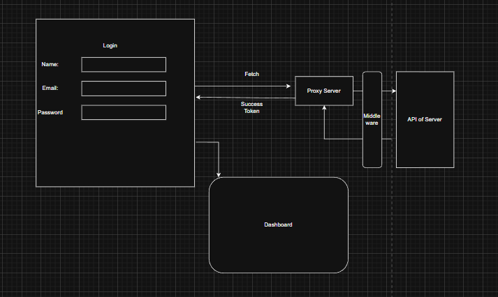

# FrontendBasics
ReactNextJsBasics:

1. CORS always get resolved in backend.
2. CORS origin should mmatch exact frontend URL exactly.
3. Server-Side Rendering means the rendering of the entire page and the components of the page in the server side and sending that to the client side.Client-Side Rendering means rendering the components of the entire page in the client side after sending the html css and js files from the server to the client. Painting and reloading and displaying the components on javascript code execution after reload is rendering.
4. static html css portion already is prepared already 
5. vite+Reactjs-> jsx -> build production html,css,js-> NextJs
6. React + react-DOM -> Browser
7. React + React-Native->iOS and Android
8. React + React-VR  -> VR hardware
9.  Browser blocks the CORS not the Backend
10. CORS help isolation.
11. Session Hijacking.
12. CORS 
13. Security 
14. CORS Policies
15. Cross Origin Resource sharing depends on backend configurations and values , include means cookies are to include '*' does not work in Cookies. More options are there in cookies headers.
16. Content delivery network: A content delivery network (CDN) is a geographically distributed group of servers that caches content close to end users. A CDN allows for the quick transfer of assets needed for loading Internet content, including HTML pages, JavaScript files, stylesheets, images, and videos.

The popularity of CDN services continues to grow, and today the majority of web traffic is served through CDNs, including traffic from major sites like Facebook, Netflix, and Amazon.
A properly configured CDN may also help protect websites against some common malicious attacks, such as Distributed Denial of Service (DDOS) attacks.
17.  Javascript modules can be loaded with node_modules and CDN.
18.  
19. 
20. Is React a Library or Framework?    
Ans: React is a javascript frontend library but more of a thought process. 
21. **Library** : A library is a packaged collection of reusable code (functions, classes, modules) that provides a well-defined API you call from your application to perform common tasks — e.g., DOM helpers, HTTP clients, math routines, UI components.

Purpose: reuse common functionality so you don't reimplement it.
How it works: you import/include the library and invoke its API; control stays with your code (not the library).
Forms: language standard libraries, third‑party packages, UI/component libraries, utility libraries, data/algorithm libraries.
Delivery: package managers (npm), CDNs (script/link tags), or language-specific installs.
Contrast with a framework: a library is called by your code; a framework usually calls your code (inversion of control, "Hollywood principle").
Examples (JS/frontend): lodash, axios, react (often called a library), bootstrap, d3.
When to use: pick a library when you need focused, drop‑in functionality without committing to an entire architectural approach. 
22. Client-Side and Server-Side 
23. Lot of techniques: HTML/CSS/JS functionalities plus painting everything is rendered at server side.  The frontend is rendered at client side with neccesssary js code being executed only at the server side. Specific Javascript code is only executed on demand and requirement  in the server side and the results are sent to the client side for rendering and display.
24. Javascript Browser APIs:.
JavaScript Browser APIs are interfaces provided by web browsers that allow scripts to interact with browser features and the underlying system. Key APIs include:

- **DOM API**: Manipulate HTML elements, modify styles, and handle events
- **Fetch API**: Make HTTP requests asynchronously without page reload
- **LocalStorage & SessionStorage**: Store key-value data client-side persistently or temporarily
- **Geolocation API**: Access user's geographic location (with permission)
- **Notification API**: Send desktop notifications to users
- **Service Workers API**: Enable offline functionality, caching, and background tasks
- **WebSockets API**: Establish persistent two-way communication with servers
- **Canvas API**: Draw graphics programmatically
- **Web Audio API**: Process and synthesize audio
- **Clipboard API**: Read/write to user's clipboard
- **IntersectionObserver API**: Detect when elements enter the viewport
- **History API**: Manage browser session history
- **Geolocation API**: Access device location data
- **Battery Status API**: Monitor device battery level
25. ````
````
30. **Virtual DOM**: A virtual DOM is an in-memory representation of the actual DOM maintained by React. It's a lightweight JavaScript object that mirrors the structure of the real DOM. React uses it to optimize rendering performance by avoiding direct manipulation of the actual DOM (which is slow). When state changes, React creates a new virtual DOM tree and compares it with the previous one before updating only the changed elements in the real DOM.

31. **Diffing Algorithm**: The diffing algorithm is React's mechanism for comparing two virtual DOM trees (old and new) to identify what has changed. React walks through both trees recursively and marks elements that differ. The algorithm uses heuristics like component type and key props to optimize the comparison process. This process is crucial because it minimizes the number of operations needed on the actual DOM, improving performance significantly.

32. **Reconciliation**: Reconciliation is the process that follows diffing—it's the act of updating the real DOM based on the differences found by the diffing algorithm. React takes the identified changes and applies only those specific updates to the actual DOM. This batched update approach is much more efficient than re-rendering the entire page. Reconciliation ensures that the UI stays in sync with the application state while maintaining optimal performance.

33. **React-Native**: React-Native is a framework for building native mobile applications (iOS and Android) using React and JavaScript. Instead of compiling to web assets, React-Native compiles to native code, allowing developers to write once and deploy to multiple platforms. It uses native components rather than web components, providing better performance and a more native feel. React-Native shares the same component-based architecture and state management patterns as React, making it easy for web developers to transition to mobile development. Popular apps like Facebook, Instagram, Uber, and Airbnb use React-Native in production.

34. **React props**: React props are short for "properties" and serve as a mechanism for passing data from parent components to child components. They are read-only and allow you to create reusable, dynamic components by providing different data to the same component structure. Key purposes include:

- **Data Flow**: Enable unidirectional data flow from parent to child components
- **Reusability**: Allow components to be flexible and work with different data
- **Configuration**: Let you customize component behavior without modifying the component code
- **Separation of Concerns**: Keep components focused on presentation while parents handle logic

In functional components, props are accessed as a function parameter object, allowing you to destructure specific values or access them via dot notation (e.g., `props.name`). Props are immutable—attempting to modify them directly will result in errors.

35. Babel is required for translating  jsx to vanilla javascript.

